# SharePoint as Primary Database Strategy

## 🎯 Executive Summary

**Approach**: SharePoint Lists as primary database + PostgreSQL as runtime cache
**Goal**: SharePoint is source of truth, PostgreSQL auto-regenerates from SharePoint on startup
**Architecture**: Bootstrap-on-startup pattern with lazy loading

---

## 📐 Architecture Overview

```
                              ┌────────────────────────┐
                              │  SharePoint Lists      │
                              │  (PRIMARY DATABASE)    │
                              │  - Source of Truth     │
                              └──────────┬─────────────┘
                                         │
                                         ↓
                              ┌────────────────────────┐
                              │   Microsoft Graph API  │
                              └──────────┬─────────────┘
                                         │
                                         ↓
┌─────────────────────────────────────────────────────────────┐
│                    Twenty Application                        │
│                                                               │
│  ┌──────────────────────────────────────────┐               │
│  │     Application Bootstrap Service        │               │
│  │  1. Check SharePoint structure           │               │
│  │  2. Create missing lists/columns         │               │
│  │  3. Load data to PostgreSQL cache        │               │
│  └──────────────┬───────────────────────────┘               │
│                 │                                             │
│                 ↓                                             │
│  ┌────────────┐  ┌──────────────┐  ┌──────────────┐        │
│  │  GraphQL   │→ │  Repository  │→ │  PostgreSQL  │        │
│  │    API     │  │    Layer     │  │  (Runtime    │        │
│  │            │  │              │  │   Cache)     │        │
│  └────────────┘  └──────────────┘  └──────┬───────┘        │
│                                             │                 │
│                                             ↓                 │
│                          ┌──────────────────────────────┐    │
│                          │  SharePoint Write-back       │    │
│                          │  Service (Async)             │    │
│                          └──────────────────────────────┘    │
└─────────────────────────────────────────────────────────────┘
```

**Key Principles:**
1. **SharePoint = Source of Truth**: All workspace data persists in SharePoint
2. **PostgreSQL = Disposable Cache**: Can be dropped and recreated anytime
3. **Auto-Bootstrap**: App checks SharePoint on startup, creates missing structure
4. **Lazy Loading**: Only load data when needed, not all at once
5. **Async Write-back**: Changes written to PostgreSQL immediately, synced to SharePoint async
6. **ID Independence**: Sync mechanism works independently from Twenty's business logic

---

## 🔑 ID Mapping Strategy

### **The Challenge**

- **Twenty (PostgreSQL)**: Uses UUID (e.g., `550e8400-e29b-41d4-a716-446655440000`)
- **SharePoint**: Auto-increment numeric ID (e.g., `1`, `2`, `3`)
- **Requirement**: Sync phải hoạt động độc lập, không ảnh hưởng nghiệp vụ Twenty

### **Solution: Custom Column "TwentyId"**

```typescript
// SharePoint List Structure
{
  "ID": 123,                                          // SharePoint auto-increment
  "TwentyId": "550e8400-e29b-41d4-a716-446655440000", // Custom column chứa UUID
  "Title": "Acme Corporation",
  "Employees": 500,
  // ... other fields
}
```

### **ID Mapping Flow**

#### **1. Create Flow (Twenty → SharePoint)**
```typescript
// User creates company in Twenty
const company = await repository.save({
  id: uuidv4(), // Twenty generates UUID
  name: "Acme Corp",
  // ...
});

// Background job writes to SharePoint
await sharePointService.createListItem(siteId, listId, {
  TwentyId: company.id,  // ← Store Twenty UUID in custom column
  Title: company.name,
  // ...
});
// SharePoint auto-generates ID: 123
```

#### **2. Load Flow (SharePoint → Twenty)**
```typescript
// Load from SharePoint
const sharePointItems = await sharePointService.getListItems(siteId, listId);

// Transform to Twenty format
const companies = sharePointItems.map(item => ({
  id: item.fields.TwentyId,  // ← Use TwentyId as primary key in PostgreSQL
  name: item.fields.Title,
  // ...
  // SharePoint ID (123) không được lưu vào PostgreSQL
}));

// Insert into PostgreSQL
await repository.insert(companies);
```

#### **3. Update Flow (Twenty → SharePoint)**
```typescript
// User updates company in Twenty (by UUID)
await repository.update(
  { id: "550e8400-e29b-41d4-a716-446655440000" },
  { name: "Acme Corporation Inc" }
);

// Background job finds SharePoint item by TwentyId
const sharePointItems = await sharePointService.getListItems(siteId, listId, {
  filter: `fields/TwentyId eq '550e8400-e29b-41d4-a716-446655440000'`
});

const sharePointId = sharePointItems[0].id; // SharePoint ID: 123

// Update SharePoint item
await sharePointService.updateListItem(siteId, listId, sharePointId, {
  Title: "Acme Corporation Inc"
});
```

#### **4. Delete Flow (Twenty → SharePoint)**
```typescript
// User deletes company in Twenty
await repository.delete({ id: "550e8400-e29b-41d4-a716-446655440000" });

// Background job finds and deletes SharePoint item
const sharePointItems = await sharePointService.getListItems(siteId, listId, {
  filter: `fields/TwentyId eq '550e8400-e29b-41d4-a716-446655440000'`
});

if (sharePointItems.length > 0) {
  const sharePointId = sharePointItems[0].id;
  await sharePointService.deleteListItem(siteId, listId, sharePointId);
}
```

### **Key Design Decisions**

| Decision | Rationale |
|----------|-----------|
| **TwentyId column is REQUIRED** | Always created during bootstrap, indexed for fast lookup |
| **SharePoint ID never stored in PostgreSQL** | Keep PostgreSQL clean, only use Twenty UUIDs |
| **Lookup by TwentyId for updates/deletes** | Single source of truth for record identity |
| **No bidirectional ID mapping table** | Simplifies architecture, reduces complexity |
| **TwentyId is immutable** | Never changes, safe for lookups |

### **Performance Optimization**

```typescript
// ✅ GOOD: Filter on SharePoint side (fast)
const items = await graphClient
  .api(`/sites/${siteId}/lists/${listId}/items`)
  .filter(`fields/TwentyId eq '${uuid}'`)
  .top(1)
  .get();

// ❌ BAD: Load all items then filter in code (slow)
const allItems = await graphClient.api(`/sites/${siteId}/lists/${listId}/items`).get();
const item = allItems.find(i => i.fields.TwentyId === uuid);
```

**Note**: SharePoint automatically indexes custom columns, TwentyId lookups are fast.

---

## 🔗 Relation Columns (Foreign Keys)

### **Problem: How to store relations?**

Twenty uses UUID for foreign keys (e.g., `companyId`, `authorId`). SharePoint có 2 options:

1. ❌ **SharePoint Lookup Columns** - Links to SharePoint numeric ID (BAD)
2. ✅ **Text Columns storing UUID** - Links to TwentyId (GOOD)

### **Why NOT SharePoint Lookups?**

```typescript
// ❌ BAD: SharePoint lookup column
const companyColumn = {
  name: 'Company',
  type: 'lookup',           // References SharePoint numeric ID
  lookupListId: 'xxx',      // Points to Companies list
  lookupField: 'Title',
};
// Problem: Breaks if SharePoint item deleted/recreated
```

### **✅ CORRECT: Store UUID in Text Column**

```typescript
// Bootstrap Service creates relation columns
async ensureRelationColumns(
  siteId: string,
  listId: string,
  relationFields: Array<{ name: string; referencedTable: string }>,
): Promise<void> {
  for (const field of relationFields) {
    await this.sharePointService.createColumn(siteId, listId, {
      name: field.name,           // e.g., "companyId"
      type: 'text',               // Store UUID as text
      indexed: true,              // Fast filtering
      required: false,            // Allow null relations
      description: `References ${field.referencedTable} by TwentyId`,
    });
  }
}
```

### **Example: Person → Company Relation**

**SharePoint Structure:**

```
📊 Companies List:
  - Id: 1, 2 (SharePoint auto-increment)
  - TwentyId: "uuid-company-1", "uuid-company-2"
  - Name: "Acme Corp", "Tech Inc"

📊 People List:
  - Id: 10, 11 (SharePoint auto-increment)
  - TwentyId: "uuid-person-1", "uuid-person-2"
  - Name: "John Doe", "Jane Smith"
  - companyId: "uuid-company-1", "uuid-company-2"  ⬅️ Stores Company's TwentyId
```

### **Code: Reading Relations**

```typescript
async loadPersonWithCompany(personTwentyId: string): Promise<any> {
  // 1. Find person by TwentyId
  const personItem = await this.sharePointService.findItemByTwentyId(
    siteId, 'People', personTwentyId
  );

  // 2. Get companyId (which is company's TwentyId)
  const companyTwentyId = personItem.fields.companyId;

  // 3. Find company by TwentyId
  const companyItem = await this.sharePointService.findItemByTwentyId(
    siteId, 'Companies', companyTwentyId
  );

  // 4. Return combined result
  return {
    id: personItem.fields.TwentyId,
    name: personItem.fields.Name,
    companyId: companyTwentyId,
    company: {
      id: companyItem.fields.TwentyId,
      name: companyItem.fields.Name,
    },
  };
}
```

### **Code: Writing Relations**

```typescript
async writePerson(workspaceId: string, personId: string): Promise<void> {
  // 1. Get person from PostgreSQL
  const person = await this.personRepository.findOne({
    where: { id: personId },
    relations: ['company'],
  });

  // 2. Find person in SharePoint by TwentyId
  const personItem = await this.sharePointService.findItemByTwentyId(
    siteId, 'People', person.id
  );

  // 3. Update SharePoint (store company's UUID)
  await this.graphClient
    .api(`/sites/${siteId}/lists/People/items/${personItem.id}`)
    .update({
      fields: {
        TwentyId: person.id,
        Name: person.name,
        companyId: person.company?.id,  // ⬅️ Company's TwentyId (UUID)
      },
    });
}
```

### **⚡ Performance: Batch Load Relations**

```typescript
// Avoid N+1 queries - load all relations in 2 queries

async loadPeopleWithCompanies(personTwentyIds: string[]): Promise<any[]> {
  // 1. Batch load all people
  const peopleItems = await this.sharePointService.batchFindByTwentyIds(
    siteId, 'People', personTwentyIds
  );

  // 2. Extract unique company IDs
  const companyTwentyIds = [
    ...new Set(peopleItems.map(p => p.fields.companyId).filter(Boolean))
  ];

  // 3. Batch load all companies
  const companyItems = await this.sharePointService.batchFindByTwentyIds(
    siteId, 'Companies', companyTwentyIds
  );

  // 4. Create lookup map
  const companyMap = new Map(
    companyItems.map(c => [c.fields.TwentyId, c])
  );

  // 5. Combine results
  return peopleItems.map(person => ({
    id: person.fields.TwentyId,
    name: person.fields.Name,
    companyId: person.fields.companyId,
    company: person.fields.companyId
      ? companyMap.get(person.fields.companyId)
      : null,
  }));
}
```

### **Key Rules for Relations:**

1. ✅ Store UUID (TwentyId), NOT SharePoint numeric ID
2. ✅ Use text columns, NOT SharePoint lookup columns
3. ✅ Index relation columns for fast filtering
4. ✅ Batch load to avoid N+1 queries
5. ✅ Handle null relations

---

## 🔄 Data Flow & Principles

### **Read Flow: SharePoint → PostgreSQL**

```typescript
// On application startup or workspace access
1. Check if workspace data exists in PostgreSQL
2. If missing → Load from SharePoint
3. If exists → Use cache (optionally refresh in background)
```

### **Write Flow: PostgreSQL → SharePoint**

```typescript
// On data mutation
1. Write to PostgreSQL immediately (fast response)
2. Queue async job to write to SharePoint (reliable persistence)
3. Mark as "pending sync" until confirmed
```

### **Bootstrap Flow: SharePoint Structure Management**

```typescript
// On application startup
1. Get workspace configuration (tenant, site)
2. Check SharePoint site structure
3. For each Twenty object:
   - Check if SharePoint list exists
   - Check if all columns exist
   - Create missing lists/columns
4. Ready to serve requests
```

---

## 🎯 Design Principles

| Principle | Implementation | Benefit |
|-----------|----------------|---------|
| **SharePoint = Truth** | All workspace data stored in SharePoint | Data survives PostgreSQL crashes |
| **PostgreSQL = Cache** | Can drop and recreate from SharePoint | No backup needed for workspace DB |
| **Auto-Bootstrap** | Create SharePoint structure on startup | Zero manual setup |
| **Lazy Loading** | Load data on first access | Fast startup time |
| **Async Write-back** | Queue writes to SharePoint | Fast user response |
| **Core DB Generated** | Core schema auto-migrates | Only workspace data matters |

---

## 🎯 What's Stored Where?

### **PostgreSQL Core Database** (Auto-generated, disposable)
- User accounts
- Authentication tokens
- Workspace metadata
- System configuration
- **Can be recreated** from migrations anytime

### **PostgreSQL Workspace Databases** (Cache, disposable)
- Company, Person, Opportunity
- Tasks, Notes, Activities
- Custom objects
- **Can be recreated** from SharePoint anytime

### **SharePoint Lists** (Source of Truth, permanent)
- All workspace data
- File attachments
- Custom field definitions
- **Primary storage**, survives everything

---

## 🏗️ Implementation Phases

### **Phase 1: SharePoint Bootstrap Service (Week 1-2)** ✅

**Goal**: Auto-create SharePoint structure on startup

<details>
<summary><b>1.1 Bootstrap Service Core</b></summary>

```typescript
// packages/twenty-server/src/modules/sharepoint/services/sharepoint-bootstrap.service.ts

@Injectable()
export class SharePointBootstrapService implements OnModuleInit {
  constructor(
    private readonly sharePointService: SharePointService,
    private readonly workspaceRepository: Repository<Workspace>,
    private readonly objectMetadataService: ObjectMetadataService,
  ) {}

  async onModuleInit() {
    this.logger.log('🚀 Starting SharePoint bootstrap...');
    await this.bootstrapAllWorkspaces();
    this.logger.log('✅ SharePoint bootstrap completed');
  }

  async bootstrapAllWorkspaces() {
    const workspaces = await this.workspaceRepository.find({
      where: { storageType: 'sharepoint' }
    });

    for (const workspace of workspaces) {
      await this.bootstrapWorkspace(workspace);
    }
  }

  async bootstrapWorkspace(workspace: Workspace) {
    try {
      this.logger.log(`📦 Bootstrapping workspace: ${workspace.name}`);

      // 1. Get or create SharePoint site
      const site = await this.sharePointService.getOrCreateSite(workspace);

      // 2. Get all Twenty objects for this workspace
      const objects = await this.objectMetadataService.findMany({
        where: { workspaceId: workspace.id, isCustom: true }
      });

      // 3. Ensure SharePoint lists exist for each object
      for (const object of objects) {
        await this.ensureListExists(site.id, object);
      }

      // 4. Ensure standard objects (Company, Person, Opportunity)
      await this.ensureStandardObjects(site.id, workspace.id);

      this.logger.log(`✅ Workspace ${workspace.name} bootstrapped`);

    } catch (error) {
      this.logger.error(`❌ Failed to bootstrap workspace ${workspace.name}:`, error);
      throw error;
    }
  }

  private async ensureListExists(siteId: string, objectMetadata: ObjectMetadataEntity) {
    const listName = objectMetadata.nameSingular;

    // Check if list exists
    let list = await this.sharePointService.getList(siteId, listName);

    if (!list) {
      this.logger.log(`📝 Creating SharePoint list: ${listName}`);
      list = await this.sharePointService.createList(siteId, {
        name: listName,
        displayName: objectMetadata.labelSingular,
        description: `Twenty CRM - ${objectMetadata.labelPlural}`,
      });
    }

    // CRITICAL: Ensure TwentyId column exists (for ID mapping)
    await this.ensureTwentyIdColumn(siteId, list.id);

    // Ensure all other columns exist
    await this.ensureColumns(siteId, list.id, objectMetadata);
  }

  private async ensureTwentyIdColumn(siteId: string, listId: string) {
    const existingColumn = await this.sharePointService.getColumn(siteId, listId, 'TwentyId');

    if (!existingColumn) {
      this.logger.log(`  ➕ Creating TwentyId column (required for sync)`);

      await this.sharePointService.createColumn(siteId, listId, {
        name: 'TwentyId',
        displayName: 'Twenty ID',
        type: 'text',
        required: true,  // MUST have TwentyId
        indexed: true,   // Index for fast lookups
        unique: true,    // Each TwentyId is unique
      });
    }
  }

  private async ensureColumns(siteId: string, listId: string, objectMetadata: ObjectMetadataEntity) {
    const fields = await this.objectMetadataService.getFields(objectMetadata.id);

    for (const field of fields) {
      // Skip 'id' field - we use TwentyId instead
      if (field.name === 'id') continue;

      await this.ensureColumn(siteId, listId, field);
    }
  }

  private async ensureColumn(siteId: string, listId: string, field: FieldMetadataEntity) {
    const columnName = field.name;

    // Check if column exists
    const existingColumn = await this.sharePointService.getColumn(siteId, listId, columnName);

    if (!existingColumn) {
      this.logger.log(`  ➕ Creating column: ${columnName}`);

      const columnType = this.mapTwentyTypeToSharePointType(field.type);

      await this.sharePointService.createColumn(siteId, listId, {
        name: columnName,
        displayName: field.label,
        type: columnType,
        required: !field.isNullable,
      });
    }
  }

  private mapTwentyTypeToSharePointType(twentyType: string): string {
    const typeMap = {
      'TEXT': 'text',
      'NUMBER': 'number',
      'DATE': 'dateTime',
      'BOOLEAN': 'boolean',
      'SELECT': 'choice',
      'MULTI_SELECT': 'multiChoice',
      'RELATION': 'lookup',
      'EMAIL': 'text',
      'PHONE': 'text',
      'URL': 'text',
      'CURRENCY': 'number',
    };

    return typeMap[twentyType] || 'text';
  }

  private async ensureStandardObjects(siteId: string, workspaceId: string) {
    const standardObjects = ['company', 'person', 'opportunity', 'task', 'note'];

    for (const objectName of standardObjects) {
      const objectMetadata = await this.objectMetadataService.findOne({
        where: { nameSingular: objectName, workspaceId }
      });

      if (objectMetadata) {
        await this.ensureListExists(siteId, objectMetadata);
      }
    }
  }
}
```

**Files to create:**
- `src/modules/sharepoint/services/sharepoint-bootstrap.service.ts`
- `src/modules/sharepoint/services/sharepoint-structure.service.ts`

</details>

<details>
<summary><b>1.2 SharePoint Service - Structure Management</b></summary>

```typescript
// packages/twenty-server/src/modules/sharepoint/sharepoint.service.ts

@Injectable()
export class SharePointService {
  private graphClient: Client;

  // ========== Site Management ==========

  async getOrCreateSite(workspace: Workspace): Promise<SharePointSite> {
    const siteName = `Twenty-${workspace.name}`;

    // Try to get existing site
    try {
      const site = await this.graphClient
        .api(`/sites/${workspace.tenantId}:/sites/${siteName}`)
        .get();

      return site;
    } catch (error) {
      if (error.statusCode === 404) {
        // Site doesn't exist, create it
        return await this.createSite(workspace, siteName);
      }
      throw error;
    }
  }

  async createSite(workspace: Workspace, siteName: string): Promise<SharePointSite> {
    const site = await this.graphClient
      .api('/sites')
      .post({
        displayName: siteName,
        name: siteName,
        description: `Twenty CRM workspace for ${workspace.name}`,
        webTemplate: 'STS#3', // Team site
      });

    return site;
  }

  // ========== List Management ==========

  async getList(siteId: string, listName: string): Promise<any | null> {
    try {
      const list = await this.graphClient
        .api(`/sites/${siteId}/lists`)
        .filter(`displayName eq '${listName}'`)
        .get();

      return list.value[0] || null;
    } catch (error) {
      return null;
    }
  }

  async createList(siteId: string, config: { name: string; displayName: string; description: string }): Promise<any> {
    const list = await this.graphClient
      .api(`/sites/${siteId}/lists`)
      .post({
        displayName: config.displayName,
        list: {
          template: 'genericList',
          hidden: false,
        },
        description: config.description,
      });

    return list;
  }

  // ========== Column Management ==========

  async getColumn(siteId: string, listId: string, columnName: string): Promise<any | null> {
    try {
      const columns = await this.graphClient
        .api(`/sites/${siteId}/lists/${listId}/columns`)
        .get();

      return columns.value.find((col: any) => col.name === columnName) || null;
    } catch (error) {
      return null;
    }
  }

  async createColumn(siteId: string, listId: string, config: {
    name: string;
    displayName: string;
    type: string;
    required: boolean;
    indexed?: boolean;   // For TwentyId lookups
    unique?: boolean;    // Ensure uniqueness
  }): Promise<any> {
    const columnDefinition: any = {
      name: config.name,
      displayName: config.displayName,
      required: config.required,
      indexed: config.indexed || false,
      enforceUniqueValues: config.unique || false,
    };

    // Map type to SharePoint column type
    switch (config.type) {
      case 'text':
        columnDefinition.text = {
          allowMultipleLines: false,
          maxLength: config.name === 'TwentyId' ? 36 : 255, // UUID is 36 chars
        };
        break;
      case 'number':
        columnDefinition.number = {};
        break;
      case 'dateTime':
        columnDefinition.dateTime = { format: 'dateTime' };
        break;
      case 'boolean':
        columnDefinition.boolean = {};
        break;
      case 'choice':
        columnDefinition.choice = { choices: [] };
        break;
      default:
        columnDefinition.text = {};
    }

    const column = await this.graphClient
      .api(`/sites/${siteId}/lists/${listId}/columns`)
      .post(columnDefinition);

    return column;
  }

    const column = await this.graphClient
      .api(`/sites/${siteId}/lists/${listId}/columns`)
      .post(columnDefinition);

    return column;
  }

  // ========== Data Operations ==========

  async getListItems(siteId: string, listId: string, options?: {
    filter?: string;
    select?: string[];
    top?: number;
  }): Promise<any[]> {
    let query = this.graphClient.api(`/sites/${siteId}/lists/${listId}/items`).expand('fields');

    if (options?.filter) query = query.filter(options.filter);
    if (options?.select) query = query.select(options.select.join(','));
    if (options?.top) query = query.top(options.top);

    const response = await query.get();
    return response.value;
  }

  async createListItem(siteId: string, listId: string, data: any): Promise<any> {
    const item = await this.graphClient
      .api(`/sites/${siteId}/lists/${listId}/items`)
      .post({
        fields: data
      });

    return item;
  }

  async updateListItem(siteId: string, listId: string, itemId: string, data: any): Promise<any> {
    const item = await this.graphClient
      .api(`/sites/${siteId}/lists/${listId}/items/${itemId}`)
      .patch({
        fields: data
      });

    return item;
  }

  async deleteListItem(siteId: string, listId: string, itemId: string): Promise<void> {
    await this.graphClient
      .api(`/sites/${siteId}/lists/${listId}/items/${itemId}`)
      .delete();
  }

  // ========== Batch Operations ==========

  async batchCreateItems(siteId: string, listId: string, items: any[]): Promise<void> {
    const batchSize = 20; // SharePoint batch limit

    for (let i = 0; i < items.length; i += batchSize) {
      const batch = items.slice(i, i + batchSize);

      const batchRequest = this.graphClient.api('/$batch').post({
        requests: batch.map((item, index) => ({
          id: `${i + index}`,
          method: 'POST',
          url: `/sites/${siteId}/lists/${listId}/items`,
          body: { fields: item },
          headers: { 'Content-Type': 'application/json' }
        }))
      });

      await batchRequest;
    }
  }
}
```

</details>

---

### **Phase 2: Data Loading Service (Week 2-3)** 🔥

**Goal**: Load workspace data from SharePoint to PostgreSQL cache on first access

<details>
<summary><b>2.1 Workspace Data Loader</b></summary>

```typescript
// src/modules/sharepoint/services/sharepoint-data-loader.service.ts

@Injectable()
export class SharePointDataLoaderService {
  constructor(
    private readonly sharePointService: SharePointService,
    private readonly dataSourceService: DataSourceService,
    private readonly objectMetadataService: ObjectMetadataService,
    private readonly workspaceRepository: Repository<Workspace>,
  ) {}

  /**
   * Load all workspace data from SharePoint to PostgreSQL
   * Called on workspace first access or when cache is missing
   */
  async loadWorkspaceData(workspaceId: string): Promise<void> {
    this.logger.log(`📥 Loading workspace data from SharePoint: ${workspaceId}`);

    const workspace = await this.workspaceRepository.findOne({ where: { id: workspaceId } });
    const site = await this.sharePointService.getOrCreateSite(workspace);

    // Get all objects for this workspace
    const objects = await this.objectMetadataService.findMany({
      where: { workspaceId, isActive: true }
    });

    // Load data for each object
    for (const object of objects) {
      await this.loadObjectData(workspaceId, site.id, object);
    }

    this.logger.log(`✅ Workspace data loaded: ${workspaceId}`);
  }

  /**
   * Load data for a specific object from SharePoint
   */
  async loadObjectData(
    workspaceId: string,
    siteId: string,
    objectMetadata: ObjectMetadataEntity
  ): Promise<void> {
    const listName = objectMetadata.nameSingular;

    this.logger.log(`  📦 Loading ${listName}...`);

    // Get SharePoint list
    const list = await this.sharePointService.getList(siteId, listName);
    if (!list) {
      this.logger.warn(`  ⚠️ List ${listName} not found in SharePoint, skipping`);
      return;
    }

    // Get all items from SharePoint
    const sharePointItems = await this.sharePointService.getListItems(siteId, list.id);

    if (sharePointItems.length === 0) {
      this.logger.log(`  ℹ️ No data for ${listName}`);
      return;
    }

    // Get workspace datasource
    const dataSource = await this.dataSourceService.connectToWorkspaceDataSource(workspaceId);
    const repository = dataSource.getRepository(objectMetadata.nameSingular);

    // Transform and insert data
    const records = sharePointItems.map(item =>
      this.transformSharePointItemToRecord(item.fields, objectMetadata)
    );

    // Bulk insert (faster than one-by-one)
    await repository
      .createQueryBuilder()
      .insert()
      .values(records)
      .orIgnore() // Skip if already exists
      .execute();

    this.logger.log(`  ✅ Loaded ${records.length} ${listName} records`);
  }

  /**
   * Transform SharePoint item to Twenty record
   */
  private transformSharePointItemToRecord(
    sharePointItem: any,
    objectMetadata: ObjectMetadataEntity
  ): any {
    // CRITICAL: Use TwentyId from SharePoint as the primary key
    // This maintains ID consistency across systems
    if (!sharePointItem.TwentyId) {
      this.logger.error(`SharePoint item missing TwentyId: ${JSON.stringify(sharePointItem)}`);
      throw new Error('SharePoint item must have TwentyId field');
    }

    const record: any = {
      id: sharePointItem.TwentyId, // ← Use TwentyId, not SharePoint numeric ID
    };

    // Map each field (skip 'id' since we already set it)
    for (const field of objectMetadata.fields) {
      if (field.name === 'id') continue; // Already handled above

      const sharePointValue = sharePointItem[field.name];
      record[field.name] = this.transformFieldValue(sharePointValue, field.type);
    }

    // Set timestamps from SharePoint metadata
    record.createdAt = sharePointItem.Created ? new Date(sharePointItem.Created) : new Date();
    record.updatedAt = sharePointItem.Modified ? new Date(sharePointItem.Modified) : new Date();

    return record;
  }

  private transformFieldValue(value: any, fieldType: string): any {
    if (value === null || value === undefined) return null;

    switch (fieldType) {
      case 'DATE':
        return new Date(value);
      case 'BOOLEAN':
        return Boolean(value);
      case 'NUMBER':
      case 'CURRENCY':
        return Number(value);
      case 'SELECT':
      case 'MULTI_SELECT':
        return value; // Already in correct format
      default:
        return String(value);
    }
  }

  /**
   * Check if workspace data needs to be loaded
   */
  async shouldLoadWorkspaceData(workspaceId: string): Promise<boolean> {
    const dataSource = await this.dataSourceService.connectToWorkspaceDataSource(workspaceId);

    // Check if Company table has data (indicator that workspace is loaded)
    const companyRepository = dataSource.getRepository('company');
    const count = await companyRepository.count();

    return count === 0; // Load if no data exists
  }
}
```

</details>

<details>
<summary><b>2.2 Lazy Loading on First Access</b></summary>

```typescript
// src/modules/workspace/services/workspace-initialization.service.ts

@Injectable()
export class WorkspaceInitializationService {
  constructor(
    private readonly sharePointDataLoader: SharePointDataLoaderService,
    private readonly cacheManager: CacheManager,
  ) {}

  async ensureWorkspaceDataLoaded(workspaceId: string): Promise<void> {
    const cacheKey = `workspace:${workspaceId}:loaded`;

    // Check cache first
    const isLoaded = await this.cacheManager.get(cacheKey);
    if (isLoaded) return;

    // Check if data exists in PostgreSQL
    const shouldLoad = await this.sharePointDataLoader.shouldLoadWorkspaceData(workspaceId);

    if (shouldLoad) {
      this.logger.log(`🔄 First access to workspace ${workspaceId}, loading from SharePoint...`);
      await this.sharePointDataLoader.loadWorkspaceData(workspaceId);
    }

    // Mark as loaded in cache (TTL: 1 hour)
    await this.cacheManager.set(cacheKey, true, 3600);
  }
}
```

**Hook into GraphQL resolver:**

```typescript
// src/engine/api/graphql/workspace-resolver-builder/workspace-resolver-builder.service.ts

@Injectable()
export class WorkspaceResolverBuilderService {
  constructor(
    private readonly workspaceInitService: WorkspaceInitializationService,
  ) {}

  async resolve(workspaceId: string, query: any) {
    // Ensure workspace data is loaded before any query
    await this.workspaceInitService.ensureWorkspaceDataLoaded(workspaceId);

    // Continue with normal resolution
    return this.executeQuery(workspaceId, query);
  }
}
```

</details>

---

### **Phase 3: Write-back Service (Week 3-4)** 🔄

**Goal**: Persist changes from PostgreSQL to SharePoint asynchronously
```

</details>

---

### **Phase 3: Sync Jobs Processing (Week 3-4)** 🔄


<details>
<summary><b>3.1 Event Listener for Write-back</b></summary>

```typescript
// src/modules/sharepoint/listeners/sharepoint-writeback.listener.ts

@Injectable()
export class SharePointWritebackListener {
  constructor(
    @InjectMessageQueue(MessageQueue.sharePointWritebackQueue)
    private readonly writebackQueue: MessageQueueService,
  ) {}

  @OnEvent('*.created')
  async handleCreated(payload: WorkspaceEventBatch<ObjectRecordCreateEvent<any>>) {
    const { workspaceId, objectMetadata, events } = payload;

    // Queue write-back job
    await this.writebackQueue.add('writeback-create', {
      workspaceId,
      objectName: objectMetadata.nameSingular,
      action: 'create',
      records: events.map(e => e.properties.after),
    });
  }

  @OnEvent('*.updated')
  async handleUpdated(payload: WorkspaceEventBatch<ObjectRecordUpdateEvent<any>>) {
    const { workspaceId, objectMetadata, events } = payload;

    await this.writebackQueue.add('writeback-update', {
      workspaceId,
      objectName: objectMetadata.nameSingular,
      action: 'update',
      records: events.map(e => ({
        id: e.recordId,
        data: e.properties.after,
      })),
    });
  }

  @OnEvent('*.deleted')
  async handleDeleted(payload: WorkspaceEventBatch<ObjectRecordDeleteEvent<any>>) {
    const { workspaceId, objectMetadata, events } = payload;

    await this.writebackQueue.add('writeback-delete', {
      workspaceId,
      objectName: objectMetadata.nameSingular,
      action: 'delete',
      recordIds: events.map(e => e.recordId),
    });
  }
}
```

</details>

<details>
<summary><b>3.2 Write-back Job Processor</b></summary>

```typescript
// src/modules/sharepoint/jobs/sharepoint-writeback.job.ts

@Processor(MessageQueue.sharePointWritebackQueue)
export class SharePointWritebackJob {
  constructor(
    private readonly sharePointService: SharePointService,
    private readonly workspaceRepository: Repository<Workspace>,
  ) {}

  @Process('writeback-create')
  async handleCreate(job: Job<WritebackJobData>) {
    const { workspaceId, objectName, records } = job.data;

    const workspace = await this.workspaceRepository.findOne({ where: { id: workspaceId } });
    const site = await this.sharePointService.getOrCreateSite(workspace);
    const list = await this.sharePointService.getList(site.id, objectName);

    // Transform records to SharePoint format
    // IMPORTANT: Each record.id (Twenty UUID) is stored in TwentyId column
    const sharePointItems = records.map(record =>
      this.transformRecordToSharePointItem(record, objectName)
    );

    // Batch create in SharePoint
    // SharePoint will auto-generate numeric IDs (1, 2, 3...)
    // But we store Twenty UUIDs in TwentyId column for lookups
    await this.sharePointService.batchCreateItems(site.id, list.id, sharePointItems);

    this.logger.log(`✅ Written ${records.length} ${objectName} to SharePoint`);
  }

  @Process('writeback-update')
  async handleUpdate(job: Job<WritebackJobData>) {
    const { workspaceId, objectName, records } = job.data;

    const workspace = await this.workspaceRepository.findOne({ where: { id: workspaceId } });
    const site = await this.sharePointService.getOrCreateSite(workspace);
    const list = await this.sharePointService.getList(site.id, objectName);

    // For each record, find SharePoint item by TwentyId and update
    for (const { id, data } of records) {
      // Lookup SharePoint item using TwentyId (Twenty UUID)
      const sharePointItem = await this.findSharePointItemByTwentyId(site.id, list.id, id);

      if (sharePointItem) {
        // Found: Update using SharePoint numeric ID
        const updateData = this.transformRecordToSharePointItem(data, objectName);
        await this.sharePointService.updateListItem(
          site.id,
          list.id,
          sharePointItem.id,  // ← SharePoint numeric ID (e.g., 123)
          updateData
        );
      } else {
        // Not found: Create new item (shouldn't happen but handle gracefully)
        this.logger.warn(`SharePoint item not found for ${objectName}:${id}, creating new`);
        await this.sharePointService.createListItem(site.id, list.id, {
          TwentyId: id,  // ← Store Twenty UUID
          ...this.transformRecordToSharePointItem(data, objectName)
        });
      }
    }
  }

  @Process('writeback-delete')
  async handleDelete(job: Job<WritebackJobData>) {
    const { workspaceId, objectName, recordIds } = job.data;

    const workspace = await this.workspaceRepository.findOne({ where: { id: workspaceId } });
    const site = await this.sharePointService.getOrCreateSite(workspace);
    const list = await this.sharePointService.getList(site.id, objectName);

    for (const twentyId of recordIds) {
      // Lookup SharePoint item by TwentyId (Twenty UUID)
      const sharePointItem = await this.findSharePointItemByTwentyId(site.id, list.id, twentyId);

      if (sharePointItem) {
        // Delete using SharePoint numeric ID
        await this.sharePointService.deleteListItem(
          site.id,
          list.id,
          sharePointItem.id  // ← SharePoint numeric ID (e.g., 123)
        );
      } else {
        this.logger.warn(`SharePoint item not found for delete: ${objectName}:${twentyId}`);
      }
    }
  }

  /**
   * Find SharePoint item by Twenty UUID
   * Returns SharePoint item with numeric ID if found
   */
  private async findSharePointItemByTwentyId(
    siteId: string,
    listId: string,
    twentyId: string
  ): Promise<any | null> {
    // Query SharePoint using TwentyId column (indexed for performance)
    const items = await this.sharePointService.getListItems(siteId, listId, {
      filter: `fields/TwentyId eq '${twentyId}'`,  // ← Filter by Twenty UUID
      top: 1
    });

    // Returns: { id: 123, fields: { TwentyId: "uuid", Title: "..." } }
    return items[0] || null;
  }

  private transformRecordToSharePointItem(record: any, objectName: string): any {
    const transformer = {
      company: this.transformCompany,
      person: this.transformPerson,
      opportunity: this.transformOpportunity,
    }[objectName] || this.transformGeneric;

    return transformer.call(this, record);
  }

  /**
   * Transform Company record to SharePoint format
   * CRITICAL: Always include TwentyId for ID mapping
   */
  private transformCompany(company: any): any {
    return {
      TwentyId: company.id,  // ← REQUIRED: Twenty UUID for lookups
      Title: company.name,
      DomainName: company.domainName,
      Employees: company.employees,
      Address: company.address,
      CreatedAt: company.createdAt?.toISOString(),
      UpdatedAt: company.updatedAt?.toISOString(),
    };
  }

  /**
   * Transform Person record to SharePoint format
   * CRITICAL: Always include TwentyId for ID mapping
   */
  private transformPerson(person: any): any {
    return {
      TwentyId: person.id,  // ← REQUIRED: Twenty UUID for lookups
      Title: `${person.firstName} ${person.lastName}`,
      FirstName: person.firstName,
      LastName: person.lastName,
      Email: person.email,
      Phone: person.phone,
      CompanyId: person.companyId,  // Note: This is also a UUID (foreign key)
      CreatedAt: person.createdAt?.toISOString(),
      UpdatedAt: person.updatedAt?.toISOString(),
    };
  }

  /**
   * Transform Opportunity record to SharePoint format
   * CRITICAL: Always include TwentyId for ID mapping
   */
  private transformOpportunity(opportunity: any): any {
    return {
      TwentyId: opportunity.id,  // ← REQUIRED: Twenty UUID for lookups
      Title: opportunity.name,
      Amount: opportunity.amount,
      Stage: opportunity.stage,
      CloseDate: opportunity.closeDate?.toISOString(),
      CompanyId: opportunity.companyId,  // Note: This is also a UUID (foreign key)
      CreatedAt: opportunity.createdAt?.toISOString(),
      UpdatedAt: opportunity.updatedAt?.toISOString(),
    };
  }

  /**
   * Generic transformation for custom objects
   * CRITICAL: Always include TwentyId for ID mapping
   */
  private transformGeneric(record: any): any {
    const sharePointItem: any = {
      TwentyId: record.id,  // ← REQUIRED: Twenty UUID for lookups
    };

    // Copy all fields except 'id' (already stored as TwentyId)
    for (const [key, value] of Object.entries(record)) {
      if (key !== 'id' && value !== undefined) {
        sharePointItem[key] = value;
      }
    }

    return sharePointItem;
  }
}

interface WritebackJobData {
  workspaceId: string;
  objectName: string;
  action: 'create' | 'update' | 'delete';
  records?: any[];
  recordIds?: string[];
}
```

</details>

---

## 🔄 Data Flow Diagrams

### **Startup Flow: Bootstrap SharePoint Structure**

```mermaid
sequenceDiagram
    participant App as Twenty App
    participant Bootstrap as Bootstrap Service
    participant SP as SharePoint Service
    participant Graph as Microsoft Graph API

    App->>Bootstrap: onModuleInit()
    Bootstrap->>Bootstrap: Get all workspaces (storageType=sharepoint)

    loop For each workspace
        Bootstrap->>SP: getOrCreateSite(workspace)
        SP->>Graph: GET /sites/{tenant}/sites/{name}
        alt Site exists
            Graph-->>SP: Site details
        else Site not found
            SP->>Graph: POST /sites (create new)
            Graph-->>SP: New site created
        end

        Bootstrap->>Bootstrap: Get all objects (standard + custom)

        loop For each object
            Bootstrap->>SP: ensureListExists(siteId, object)
            SP->>Graph: GET /sites/{id}/lists?filter=displayName

            alt List exists
                Graph-->>SP: List details
            else List not found
                SP->>Graph: POST /sites/{id}/lists (create)
                Graph-->>SP: New list created
            end

            loop For each field
                Bootstrap->>SP: ensureColumn(listId, field)
                SP->>Graph: GET /lists/{id}/columns

                alt Column exists
                    Graph-->>SP: Column exists, skip
                else Column not found
                    SP->>Graph: POST /lists/{id}/columns
                    Graph-->>SP: Column created
                end
            end
        end
    end

    Bootstrap-->>App: ✅ Bootstrap complete
```



---

### **Read Flow: First Workspace Access**


---

### **Write Flow: User Creates Company**

```mermaid
sequenceDiagram
    participant User
    participant GraphQL
    participant Repo as Repository
    participant PG as PostgreSQL
    participant Events as Event Emitter
    participant Queue as BullMQ
    participant Job as Writeback Job
    participant SP as SharePoint Service
    participant Graph as Microsoft Graph API

    User->>GraphQL: Mutation: createCompany
    GraphQL->>Repo: create(company)
    Repo->>PG: INSERT INTO company
    PG-->>Repo: ✅ Inserted (id: 123)
    Repo-->>GraphQL: Company created
    GraphQL-->>User: 200 OK (fast response)

    Note over Repo,Events: Async write-back begins

    Repo->>Events: emit('company.created', company)
    Events->>Queue: add('writeback-create', {company})

    Queue->>Job: Process job
    Job->>SP: getOrCreateSite(workspace)
    Job->>SP: getList(siteId, 'company')
    Job->>SP: transformRecordToSharePointItem(company)
    Job->>SP: createListItem(siteId, listId, item)
    SP->>Graph: POST /sites/{id}/lists/{listId}/items
    Graph-->>SP: ✅ Item created (SharePoint ID: 456)
    SP-->>Job: Success
    Job-->>Queue: Job complete

    Note over PG,Graph: Data now in both PostgreSQL (cache) and SharePoint (source of truth)
```



---

## 🎛️ Configuration

### **Environment Variables**

```bash
# SharePoint as Primary Database
WORKSPACE_DATASOURCE=sharepoint
WORKSPACE_STORAGE_TYPE=sharepoint
WORKSPACE_TENANT_ID=<your-tenant-id>

# SharePoint Site Configuration
SHAREPOINT_SITE_HOSTNAME=<tenant>.sharepoint.com
SHAREPOINT_SITE_PATH=/sites/Twenty-<workspace-name>

# Authentication (reuse Microsoft Auth)
AUTH_MICROSOFT_ENABLED=true
AUTH_MICROSOFT_CLIENT_ID=<client-id>
AUTH_MICROSOFT_CLIENT_SECRET=<client-secret>
AUTH_MICROSOFT_TENANT_ID=<tenant-id>

# Bootstrap Settings
SHAREPOINT_BOOTSTRAP_ON_STARTUP=true
SHAREPOINT_AUTO_CREATE_LISTS=true
SHAREPOINT_AUTO_CREATE_COLUMNS=true

# Data Loading
SHAREPOINT_LAZY_LOAD_DATA=true
SHAREPOINT_CACHE_TTL_SECONDS=3600

# Write-back Settings
SHAREPOINT_WRITEBACK_ENABLED=true
SHAREPOINT_WRITEBACK_BATCH_SIZE=20
SHAREPOINT_WRITEBACK_RETRY_ATTEMPTS=3
```

---

## 🎯 Summary: Key Differences from Old Strategy

| Aspect | Old Strategy (Bidirectional Sync) | New Strategy (SharePoint Primary) |
|--------|----------------------------------|-----------------------------------|
| **Source of Truth** | PostgreSQL | SharePoint |
| **PostgreSQL Role** | Primary database | Runtime cache (disposable) |
| **Sync Direction** | Bidirectional (complex) | One-way write-back (simple) |
| **Conflict Resolution** | Required (complex logic) | Not needed |
| **Startup Behavior** | Immediate use | Bootstrap SharePoint, lazy load data |
| **Data Loss Risk** | PostgreSQL failure = data loss | PostgreSQL can be dropped/recreated anytime |
| **Backup Strategy** | Need PostgreSQL backups | SharePoint is the backup |
| **Core Database** | Important | Disposable (auto-generated from migrations) |
| **Workspace Database** | Important | Disposable (reload from SharePoint) |
| **Complexity** | High (webhooks, conflicts, bidirectional) | Medium (bootstrap, load, write-back) |

---

## 📋 Implementation Checklist

### **Phase 1: Bootstrap Service** ✅
- [ ] Create SharePointBootstrapService
- [ ] Implement getOrCreateSite
- [ ] Implement ensureListExists
- [ ] Implement ensureColumn
- [ ] Auto-create standard objects (Company, Person, Opportunity)
- [ ] Test with empty SharePoint tenant

### **Phase 2: Data Loading** ✅
- [ ] Create SharePointDataLoaderService
- [ ] Implement loadWorkspaceData
- [ ] Implement loadObjectData
- [ ] Transform SharePoint → Twenty format
- [ ] Lazy loading on first access
- [ ] Cache loaded state

### **Phase 3: Write-back** ✅
- [ ] Create WritebackListener
- [ ] Create WritebackJob processor
- [ ] Handle create events
- [ ] Handle update events
- [ ] Handle delete events
- [ ] Transform Twenty → SharePoint format
- [ ] Retry logic for failures

### **Phase 4: Testing** ✅
- [ ] Test bootstrap with new workspace
- [ ] Test data loading from SharePoint
- [ ] Test write-back (create, update, delete)
- [ ] Test PostgreSQL cache drop/recreate
- [ ] Test with large datasets (10k+ records)
- [ ] Performance testing

### **Phase 5: Production Ready** ✅
- [ ] Error handling & logging
- [ ] Monitoring & metrics
- [ ] Rate limiting for Graph API
- [ ] Documentation
- [ ] Migration guide for existing workspaces

---

## 🚀 Migration from Existing Twenty Installations

If you have existing Twenty installations with data in PostgreSQL:

1. **Enable SharePoint storage**:
   ```bash
   WORKSPACE_DATASOURCE=sharepoint
   ```

2. **Run migration script**:
   ```bash
   yarn workspace twenty-server migrate-to-sharepoint --workspace-id=<id>
   ```

3. **Migration steps**:
   - Bootstrap SharePoint structure
   - Export all data from PostgreSQL
   - Transform to SharePoint format
   - Bulk upload to SharePoint
   - Verify data integrity
   - Drop PostgreSQL workspace DB
   - Reload from SharePoint (test)

4. **Rollback plan**:
   - Keep PostgreSQL backup for 30 days
   - Can switch back by changing `WORKSPACE_DATASOURCE`

---

## 🎓 Best Practices

1. **Always Bootstrap on Startup**: Ensures SharePoint structure exists
2. **Use Lazy Loading**: Don't load all workspaces at startup, only on first access
3. **Cache Loaded State**: Avoid redundant data loading
4. **Async Write-back**: Don't block user requests waiting for SharePoint
5. **Batch Operations**: Use SharePoint batch API to reduce API calls
6. **Handle Failures Gracefully**: Retry write-backs, log errors
7. **Monitor SharePoint API Limits**: Respect rate limits
8. **Test Cache Invalidation**: PostgreSQL should be truly disposable

---

**Estimated Implementation Time**: 4-6 weeks
**Team Size**: 2 developers
**Risk Level**: Low-Medium (well-defined architecture, clear separation of concerns)
**Benefits**: Data sovereignty, simplified architecture, no conflict resolution needed
  ) {}

  @Cron('*/5 * * * *') // Every 5 minutes
  async handleIncrementalSync() {
    const workspaces = await this.workspaceSharePointConfigService.getEnabledWorkspaces();

    for (const workspace of workspaces) {
      if (workspace.syncConfig.syncMode !== 'scheduled') continue;

      await this.performIncrementalSync(workspace);
    }
  }

  @Cron('0 2 * * *') // Daily at 2 AM
  async handleFullSync() {
    const workspaces = await this.workspaceSharePointConfigService.getEnabledWorkspaces();

    for (const workspace of workspaces) {
      await this.performFullSync(workspace);
    }
  }

  private async performIncrementalSync(workspace: WorkspaceSharePointConfigEntity) {
    // Find records modified since last sync
    const lastSync = workspace.lastFullSyncAt;

    for (const objectName of workspace.syncConfig.objectsToSync) {
      // Query modified records from PostgreSQL
      const modifiedRecords = await this.getModifiedRecords(
        workspace.workspaceId,
        objectName,
        lastSync
      );

      if (modifiedRecords.length === 0) continue;

      // Queue for sync
      await this.queueSyncJobs(workspace.workspaceId, objectName, modifiedRecords);
    }
  }

  private async performFullSync(workspace: WorkspaceSharePointConfigEntity) {
    // Sync ALL records (for initial setup or recovery)
    for (const objectName of workspace.syncConfig.objectsToSync) {
      const allRecords = await this.getAllRecords(workspace.workspaceId, objectName);

      // Compare with SharePoint to detect drift
      const drift = await this.detectDrift(workspace, objectName, allRecords);

      if (drift.length > 0) {
        await this.reconcileDrift(workspace, objectName, drift);
      }
    }

    // Update last sync timestamp
    await this.workspaceSharePointConfigService.updateLastSyncAt(workspace.id);
  }
}
```

</details>

---

### **Phase 4: Bidirectional Sync (Week 4-5)** 🔄↔️

**Goal**: Handle changes from SharePoint back to Twenty

<details>
<summary><b>4.1 SharePoint Webhook Handler</b></summary>

```typescript
// src/modules/sharepoint/controllers/sharepoint-webhook.controller.ts

@Controller('sharepoint/webhook')
export class SharePointWebhookController {
  constructor(
    @InjectMessageQueue(MessageQueue.sharePointWebhookQueue)
    private readonly webhookQueue: MessageQueueService,
  ) {}

  @Post(':workspaceId/notifications')
  async handleWebhook(
    @Param('workspaceId') workspaceId: string,
    @Body() notification: SharePointChangeNotification,
    @Query('validationToken') validationToken?: string,
  ) {
    // SharePoint webhook validation
    if (validationToken) {
      return validationToken;
    }

    // Queue webhook for processing
    await this.webhookQueue.add('process-webhook', {
      workspaceId,
      notification,
    });

    return { status: 'accepted' };
  }
}
```

```typescript
// src/modules/sharepoint/jobs/sharepoint-webhook.job.ts

@Processor(MessageQueue.sharePointWebhookQueue)
export class SharePointWebhookJob {
  @Process('process-webhook')
  async handleWebhook(job: Job<{ workspaceId: string; notification: any }>) {
    const { workspaceId, notification } = job.data;

    // Get changed items from SharePoint
    const changes = await this.sharePointService.getChanges(
      notification.resource,
      notification.changeToken
    );

    for (const change of changes) {
      // Find corresponding Twenty record
      const mapping = await this.syncMappingRepository.findOne({
        where: {
          workspaceId,
          sharePointItemId: change.itemId,
        },
      });

      if (!mapping) {
        // New item created in SharePoint
        await this.createRecordFromSharePoint(workspaceId, change);
      } else {
        // Existing item updated
        await this.updateRecordFromSharePoint(mapping, change);
      }
    }
  }

  private async updateRecordFromSharePoint(
    mapping: SharePointSyncMappingEntity,
    change: any,
  ) {
    // Detect conflicts
    const currentRecord = await this.getRecordFromTwenty(
      mapping.workspaceId,
      mapping.objectName,
      mapping.recordId,
    );

    const hasConflict = this.detectConflict(
      currentRecord,
      mapping.lastSyncedData,
      change.data,
    );

    if (hasConflict) {
      // Conflict resolution strategy
      await this.handleConflict(mapping, currentRecord, change.data);
    } else {
      // Safe to update
      await this.updateRecordInTwenty(
        mapping.workspaceId,
        mapping.objectName,
        mapping.recordId,
        this.transformFromSharePoint(change.data),
      );
    }
  }

  private detectConflict(current: any, lastSynced: any, sharePointData: any): boolean {
    // Simple conflict detection: if both sides changed since last sync
    const twentyChanged = !isEqual(current, lastSynced);
    const sharePointChanged = !isEqual(sharePointData, lastSynced);

    return twentyChanged && sharePointChanged;
  }

  private async handleConflict(
    mapping: SharePointSyncMappingEntity,
    twentyData: any,
    sharePointData: any,
  ) {
    // Strategy 1: Last Write Wins (based on updatedAt timestamp)
    const twentyUpdatedAt = new Date(twentyData.updatedAt);
    const sharePointUpdatedAt = new Date(sharePointData.Modified);

    if (sharePointUpdatedAt > twentyUpdatedAt) {
      // SharePoint wins
      await this.updateRecordInTwenty(
        mapping.workspaceId,
        mapping.objectName,
        mapping.recordId,
        this.transformFromSharePoint(sharePointData),
      );
    }
    // else: Twenty wins, do nothing (SharePoint will sync on next cycle)

    // Strategy 2: Field-level merge (optional, more complex)
    // const merged = this.mergeConflicts(twentyData, sharePointData);
    // await this.updateBothSides(mapping, merged);

    // Mark as conflict for admin review
    mapping.syncStatus = 'conflict';
    await this.syncMappingRepository.save(mapping);
  }
}
```

</details>

---

### **Phase 5: Conflict Resolution & Monitoring (Week 5-6)** ⚠️

<details>
<summary><b>5.1 Conflict Resolution UI</b></summary>

```typescript
// GraphQL resolver for admin UI

@Resolver()
export class SharePointSyncResolver {
  @Query(() => [SharePointConflict])
  async sharePointConflicts(
    @Args('workspaceId') workspaceId: string,
  ): Promise<SharePointConflict[]> {
    return this.syncMappingRepository.find({
      where: { workspaceId, syncStatus: 'conflict' },
    });
  }

  @Mutation(() => Boolean)
  async resolveSharePointConflict(
    @Args('mappingId') mappingId: string,
    @Args('resolution') resolution: 'twenty' | 'sharepoint' | 'merge',
    @Args('mergedData') mergedData?: any,
  ): Promise<boolean> {
    const mapping = await this.syncMappingRepository.findOne(mappingId);

    switch (resolution) {
      case 'twenty':
        await this.syncToSharePoint(mapping);
        break;
      case 'sharepoint':
        await this.syncToTwenty(mapping);
        break;
      case 'merge':
        await this.syncMergedData(mapping, mergedData);
        break;
    }

    mapping.syncStatus = 'synced';
    await this.syncMappingRepository.save(mapping);

    return true;
  }
}
```

</details>

<details>
<summary><b>5.2 Sync Monitoring & Metrics</b></summary>

```typescript
// src/modules/sharepoint/services/sharepoint-sync-metrics.service.ts

@Injectable()
export class SharePointSyncMetricsService {
  @Cron('*/1 * * * *') // Every minute
  async collectMetrics() {
    const metrics = await this.calculateMetrics();

    // Send to monitoring system (Grafana, DataDog, etc.)
    this.metricsService.gauge('sharepoint_sync_pending', metrics.pendingJobs);
    this.metricsService.gauge('sharepoint_sync_errors', metrics.errorCount);
    this.metricsService.gauge('sharepoint_sync_conflicts', metrics.conflictCount);
    this.metricsService.histogram('sharepoint_sync_latency', metrics.avgLatency);
  }

  private async calculateMetrics() {
    const [pending, errors, conflicts] = await Promise.all([
      this.syncMappingRepository.count({ where: { syncStatus: 'pending' } }),
      this.syncMappingRepository.count({ where: { syncStatus: 'error' } }),
      this.syncMappingRepository.count({ where: { syncStatus: 'conflict' } }),
    ]);

    return {
      pendingJobs: pending,
      errorCount: errors,
      conflictCount: conflicts,
      avgLatency: await this.calculateAvgLatency(),
    };
  }
}
```

</details>

---

## 📊 Sync Priorities by Object

### **P0 - Critical (Real-time Sync < 5s)**

| Object | Priority | Reason | Sync Direction |
|--------|----------|--------|----------------|
| **Company** | P0 | Core CRM entity, high update frequency | Bidirectional |
| **Person** | P0 | Customer contacts, critical for sales | Bidirectional |
| **Opportunity** | P0 | Revenue tracking, needs real-time updates | Bidirectional |

**Implementation:**
- Event listener triggers immediately on CRUD
- No batching
- Queue priority: 0
- Retry: 3 attempts with exponential backoff

---

### **P1 - High (Batched Sync < 30s)**

| Object | Priority | Reason | Sync Direction |
|--------|----------|--------|----------------|
| **Task** | P1 | Action items, moderate urgency | Bidirectional |
| **Note** | P1 | Important context, can tolerate delay | Bidirectional |
| **Timeline Activity** | P1 | Audit trail, near real-time preferred | One-way (Twenty → SharePoint) |

**Implementation:**
- Event listener with 10-30s buffer
- Batch multiple updates together
- Queue priority: 1
- Reduces API calls by ~70%

---

### **P2 - Medium (Scheduled Sync < 5min)**

| Object | Priority | Reason | Sync Direction |
|--------|----------|--------|----------------|
| **Attachment** | P2 | Large files, bandwidth consideration | Bidirectional |
| **Custom Objects** | P2 | User-defined, lower criticality | Bidirectional |
| **Favorite** | P2 | User preferences, low urgency | One-way (Twenty → SharePoint) |

**Implementation:**
- Cron job every 5 minutes
- Incremental sync (only changed records)
- Queue priority: 2

---

### **P3 - Low (Daily Sync)**

| Object | Priority | Reason | Sync Direction |
|--------|----------|--------|----------------|
| **Audit Logs** | P3 | Historical data, archival purpose | One-way (Twenty → SharePoint) |
| **Analytics Data** | P3 | Reporting, not time-sensitive | One-way (Twenty → SharePoint) |
| **Deleted Records** | P3 | Soft-deleted, restore capability | One-way (Twenty → SharePoint) |

**Implementation:**
- Daily cron job (2 AM)
- Full sync + cleanup
- Archive old data

---

## 🔄 Sync Workflows

### **Workflow 1: User Creates Company in Twenty**


**Total latency**: 2-5 seconds

---

### **Workflow 2: User Updates Person in SharePoint**


**Total latency**: 10-30 seconds (depends on SharePoint webhook delivery)

---

## 🎛️ Configuration

### **Environment Variables**

```bash
# SharePoint Integration
SHAREPOINT_SYNC_ENABLED=true
SHAREPOINT_CLIENT_ID=${AUTH_MICROSOFT_CLIENT_ID}
SHAREPOINT_CLIENT_SECRET=${AUTH_MICROSOFT_CLIENT_SECRET}
SHAREPOINT_TENANT_ID=<tenant-id>

# Sync Configuration
SHAREPOINT_SYNC_MODE=batched  # immediate | batched | scheduled
SHAREPOINT_BATCH_WINDOW_SECONDS=30
SHAREPOINT_MAX_BATCH_SIZE=100
SHAREPOINT_RETRY_ATTEMPTS=3
SHAREPOINT_RETRY_DELAY_MS=5000

# Webhook Configuration
SHAREPOINT_WEBHOOK_BASE_URL=https://your-domain.com
SHAREPOINT_WEBHOOK_EXPIRATION_DAYS=180
```

### **Workspace-level Configuration**

```typescript
// Admin UI to enable/configure SharePoint sync per workspace

interface WorkspaceSharePointConfig {
  enabled: boolean;
  tenantId: string;
  siteName: string;
  syncMode: 'immediate' | 'batched' | 'scheduled';
  objectsToSync: Array<'company' | 'person' | 'opportunity' | 'task' | 'note'>;
  batchWindowSeconds: number; // For batched mode
  scheduleInterval: string;   // Cron expression for scheduled mode
  conflictResolution: 'lastWriteWins' | 'manualReview' | 'twentyPriority' | 'sharePointPriority';
  enableWebhooks: boolean;
}
```

---

## 📈 Performance Optimization

### **1. Batch API Calls**

```typescript
// Instead of:
for (const item of items) {
  await sharePointService.createItem(item); // N API calls
}

// Use:
await sharePointService.batchCreateItems(items); // 1 API call
```

**Improvement**: Reduce API calls by 90%+

### **2. Incremental Sync**

```typescript
// Only sync changed records
const modifiedSince = workspace.lastSyncAt;
const changes = await repository.find({
  where: {
    updatedAt: MoreThan(modifiedSince),
  },
});
```

**Improvement**: Reduce data transfer by 95%+

### **3. Debouncing**

```typescript
// Collect rapid changes into single batch
const debounceWindow = 30000; // 30 seconds
const buffer = new Map<string, any[]>();

// Add to buffer instead of immediate sync
buffer.set(objectName, [...(buffer.get(objectName) || []), record]);

// Flush after window
setTimeout(() => {
  const batch = buffer.get(objectName);
  syncToBatch(batch);
  buffer.delete(objectName);
}, debounceWindow);
```

**Improvement**: Handle burst updates efficiently

---

## 🚨 Error Handling & Recovery

### **Error Types**

| Error Type | Retry Strategy | Alert Level |
|------------|----------------|-------------|
| Network timeout | 3 retries with exponential backoff | Warning |
| SharePoint rate limit | Wait + retry with jitter | Info |
| Authentication error | Refresh token + retry once | Error |
| Data validation error | Skip + log | Warning |
| Conflict detected | Manual review queue | Info |
| Mapping not found | Create new mapping | Info |

### **Dead Letter Queue**

```typescript
// Failed jobs after max retries go to DLQ
@Process('sync-create')
async handleSyncCreate(job: Job) {
  try {
    await this.performSync(job.data);
  } catch (error) {
    if (job.attemptsMade >= 3) {
      // Send to DLQ
      await this.deadLetterQueue.add('failed-sync', {
        originalJob: job.data,
        error: error.message,
        attempts: job.attemptsMade,
      });

      // Alert admins
      await this.alertService.send({
        level: 'error',
        message: `SharePoint sync failed after 3 retries`,
        data: job.data,
      });
    } else {
      throw error; // Retry
    }
  }
}
```

---

## 🔐 Security Considerations

### **1. Authentication**

- Use **App-only tokens** for background sync (not user tokens)
- Rotate tokens regularly
- Store tokens encrypted in database

### **2. Data Validation**

```typescript
// Validate data before sync
const schema = z.object({
  name: z.string().min(1).max(255),
  email: z.string().email().optional(),
  // ...
});

try {
  const validated = schema.parse(record);
  await sync(validated);
} catch (error) {
  // Log validation error, skip sync
  this.logger.warn(`Invalid data for sync: ${error.message}`);
}
```

### **3. Rate Limiting**

```typescript
// Respect SharePoint API limits
const rateLimiter = new RateLimiter({
  points: 600,     // 600 requests
  duration: 60,    // per minute
});

await rateLimiter.consume(workspaceId);
await sharePointService.apiCall();
```

---

## 📊 Monitoring Dashboard

### **Key Metrics to Track**

```typescript
// Grafana / DataDog dashboard

// Sync Health
sharepoint_sync_lag_seconds         // How far behind is sync?
sharepoint_sync_pending_count       // Jobs waiting
sharepoint_sync_success_rate        // % successful syncs
sharepoint_sync_error_rate          // % failed syncs

// Performance
sharepoint_api_latency_ms           // API call duration
sharepoint_sync_throughput          // Records/sec
sharepoint_batch_size_avg           // Avg items per batch

// Data Quality
sharepoint_conflict_count           // Active conflicts
sharepoint_mapping_drift_count      // Orphaned mappings
sharepoint_validation_errors        // Invalid data

// Business Metrics
sharepoint_workspaces_synced        // # workspaces using sync
sharepoint_objects_synced_total     // Total records synced
sharepoint_storage_used_gb          // SharePoint storage used
```

---

## 🧪 Testing Strategy

### **Unit Tests**

```typescript
describe('SharePointSyncJob', () => {
  it('should transform company to SharePoint item', () => {
    const company = { name: 'Acme', employees: 100 };
    const item = job.transformCompany(company);
    expect(item.Title).toBe('Acme');
    expect(item.Employees).toBe(100);
  });

  it('should handle batch create with retries', async () => {
    sharePointService.batchCreateItems.mockRejectedValueOnce(new Error('Rate limit'));
    sharePointService.batchCreateItems.mockResolvedValueOnce([]);

    await job.handleSyncCreate({ data: mockJobData });

    expect(sharePointService.batchCreateItems).toHaveBeenCalledTimes(2);
  });
});
```

### **Integration Tests**

```typescript
describe('SharePoint Sync E2E', () => {
  it('should sync company from Twenty to SharePoint', async () => {
    // Create company in Twenty
    const company = await createCompany({ name: 'Test Corp' });

    // Wait for sync
    await waitFor(() =>
      expect(syncMapping.findOne({ recordId: company.id })).toBeDefined()
    );

    // Verify in SharePoint
    const sharePointItem = await sharePointService.getListItem(siteId, listId, itemId);
    expect(sharePointItem.Title).toBe('Test Corp');
  });
});
```

---

## 📋 Implementation Checklist

### **Phase 1: Foundation** ✅
- [ ] Create SharePoint service
- [ ] Setup authentication
- [ ] Create sync mapping tables
- [ ] Implement basic CRUD operations

### **Phase 2: Event-Driven Sync** ✅
- [ ] Add SharePoint queues
- [ ] Create event listeners
- [ ] Implement priority system
- [ ] Setup BullMQ workers

### **Phase 3: Data Transformation** ✅
- [ ] Company transformer
- [ ] Person transformer
- [ ] Opportunity transformer
- [ ] Handle relations & nested objects

### **Phase 4: Bidirectional Sync** ✅
- [ ] SharePoint webhook endpoint
- [ ] Webhook job processor
- [ ] Conflict detection
- [ ] Conflict resolution strategies

### **Phase 5: Monitoring** ✅
- [ ] Metrics collection
- [ ] Grafana dashboard
- [ ] Error alerting
- [ ] Admin UI for conflicts

### **Phase 6: Testing & Polish** ✅
- [ ] Unit tests (>80% coverage)
- [ ] Integration tests
- [ ] Performance testing
- [ ] Documentation

---

## 🎓 Best Practices

1. **Start Small**: Enable sync for 1 workspace first
2. **Monitor Closely**: Watch metrics for first week
3. **Batch Everything**: Reduce API calls aggressively
4. **Handle Failures Gracefully**: Always have retry logic
5. **Keep Mappings Updated**: They're your source of truth
6. **Test Conflict Scenarios**: Simulate edge cases
7. **Optimize Incrementally**: Profile before optimizing
8. **Document Everything**: Future you will thank you

---

## 📞 Next Steps

### **Week 1-2: Setup & Testing**
1. Create SharePoint app registration in Azure
2. Implement SharePoint service
3. Create database tables
4. Test authentication flow

### **Week 3-4: Core Sync**
1. Implement event listeners
2. Create sync jobs
3. Test with Company object
4. Expand to Person & Opportunity

### **Week 5-6: Production Ready**
1. Add bidirectional sync
2. Implement conflict resolution
3. Setup monitoring
4. Load testing

### **Week 7-8: Launch**
1. Beta testing with 3-5 customers
2. Gather feedback
3. Fix bugs
4. Gradual rollout to all workspaces

---

**Total Implementation Time**: 8 weeks
**Team Size**: 2-3 developers
**Risk Level**: Medium (well-defined scope, existing infrastructure)
**ROI**: High (enterprise customers, data sovereignty compliance)
